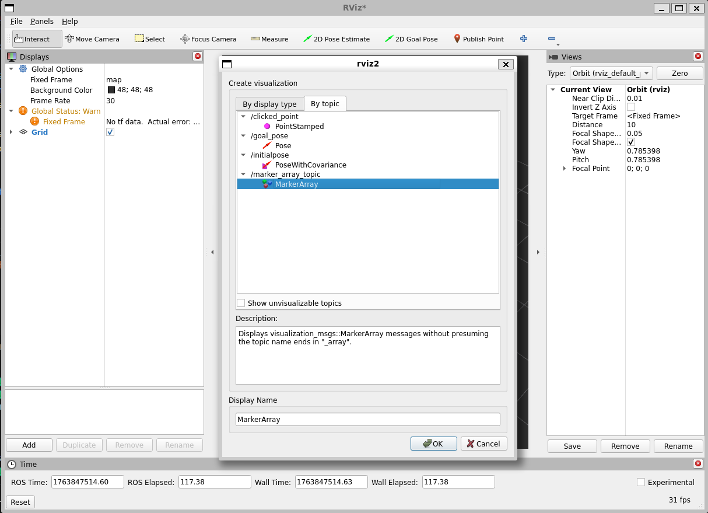
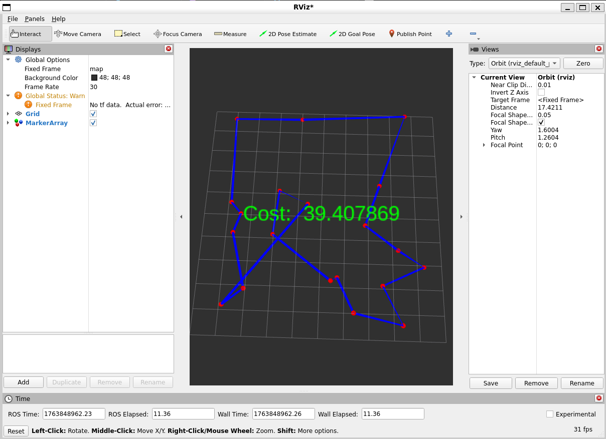
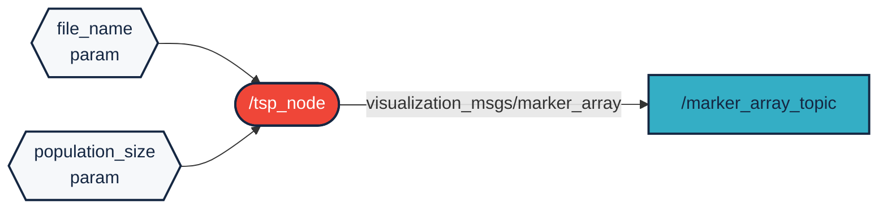

# `niz_xvn_tsp` package

ROS 2 C++ package. [](https://docs.ros.org/en/humble/)

The package consists of 1 node (/tsp_node). The node is a solver for the Traveling Salesman Problem, which is an np-hard problem. These types of problems don't have a known polynomial solution. The problem asks the following question: "Given a list of cities and the distances between each pair of cities, what is the shortest possible route than visits each city exactly once and returns to the origin city?" There're a lot a of different approaches to solve this problem, like brute forcing, dynamic programming, branch & bound / branch & cut, integer programming, etc. The previously listed techniques always calculate the optimal solution, however the runtime of these algorithms are unacceptable if there're too many cities. In practice we're usually satisfied as long as we find a good enough solution and the calculation is relatively fast. The node itself uses such an algorithm, an evolutionary algorithm.

## Packages and build

It is assumed that the workspace is `~/ros2_ws/`.

### Clone the packages

```r
cd ~/ros2_ws/src
```

```r
git clone https://github.com/nkaroly03/niz_xvn_tsp
```

### Build ROS 2 packages

```r
cd ~/ros2_ws
```

```r
colcon build --packages-select niz_xvn_tsp
```

### Run the package

The node uses csv files filled with x, y coordinates.
In order to actually run the node you must provide an $\bold{\underline{\text{filepath}}}$ as a parameter with the key name of $"\bold{\underline{\text{file}\_\text{name}}}"$. An example for file_name: "/home/your_user_name/ros2_ws/src/niz_xvn_tsp/csv/test1.csv"

<details>
<summary> Don't forget to source before ROS commands.</summary>

```bash
source ~/ros2_ws/install/setup.bash
```

</details>

```r
ros2 run niz_xvn_tsp tsp_node --ros-args -p file_name:="/home/your_user_name/ros2_ws/src/niz_xvn_tsp/csv/test1.csv"
```

Also, there's an optional parameter $"\bold{\underline{\text{population}\_\text{size}}}"$, which is an and unsigned integer type that, if not specified, defaults to the number of coordinates found in the csv file. You can supply this parameter if you believe it'll have a positive impact on the result.
With the optional parameter it would look like this:

<details>
<summary> Don't forget to source before ROS commands.</summary>

```bash
source ~/ros2_ws/install/setup.bash
```

</details>

```r
ros2 run niz_xvn_tsp tsp_node --ros-args -p file_name:="/home/your_user_name/ros2_ws/src/niz_xvn_tsp/csv/test1.csv" -p population_size:=50
```

As soon as the program starts the solving algorithm also starts.

Open rviz in a separate terminal, and add the MarkerArray topic under /marker_array_topic:

<details>
<summary> Don't forget to source before ROS commands.</summary>

```bash
source ~/ros2_ws/install/setup.bash
```

</details>

```r
ros2 run rviz2 rviz2
```



Because the wall_timer time is set to 1ns it basically shows the greatest solutions it has found. If you also want to see how the solution gets better over time then increase the 1ns duration in the source code and rebuild the package. The time cannot be parameterized because in practice you would want to get the greatest result as soon as possible.



## Diagram

Made with [Mermaid diagram](https://mermaid.js.org/intro/):


